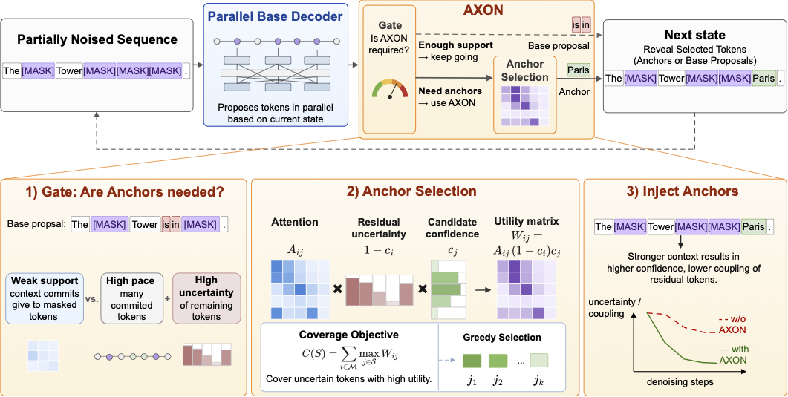
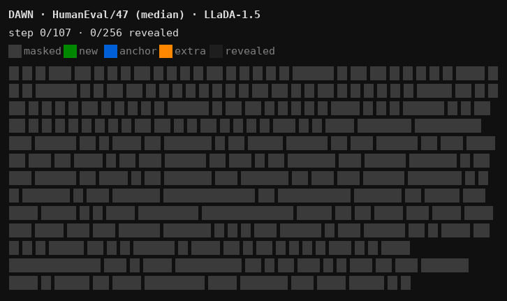
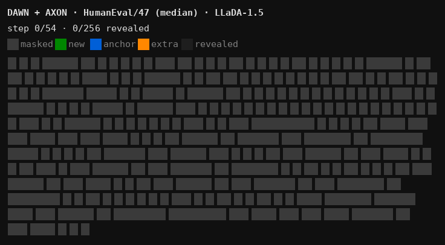

<div align="center">


<h1>AXON: Supportive Token Revealing for Fast Diffusion Language Model Decoding</h1>

[](https://arxiv.org/pdf/2606.04236)
[](./LICENSE)

</div>

AXON is a **training-free**, plug-in **scheduler** for masked diffusion language models.



## AXON in action

Both animations decode the same problem (HumanEval/47, `median`) with LLaDA-1.5 and the same base decoder.
Other methods need 107 steps, and its output fails the unit test; AXON's gate detects the stalls and reveals an anchor, un-blocking the surrounding tokens.

| Existing Parallel Decoder | Existing Parallel Decoder + AXON (ours) |
|:---:|:---:|
|  |  |
| 107 steps, fails the unit test | 54 steps, passes the unit test |

## 🚀 Features

- Training-free, plug-and-play on top of standard masked-diffusion decoders.
- Improves quality–speed: gates avoid revealing tokens that would conflict, and submodular selection picks anchors with the highest coverage of residual uncertainty.

## 🔍 Key Details

AXON augments a base diffusion-LLM decoder with three plug-in components:

1. **Adaptive gate.** A lightweight diagnostic that fires when the decoder needs help.

2. **Submodular anchor selection.** When the gate fires, AXON builds a weight matrix $w_{ij}$ over the candidate masked positions and picks an anchor set $S$ by maximising a submodular objective.

    $$f(S) \;=\; \sum_i \max_{j \in S} w_{ij}\,,$$

## 🔧 Installation
### Option A: Quick start (recommended)
```bash
pip install -r requirements.txt
```

### Option B: Reproducible install
```bash
pip install -r requirements-lock.txt
```

## ✨ Eval

### LLaDA

Run the `run_llada.sh` script at the repo root. It auto-detects the visible GPUs and launches with `accelerate`.

```bash
# Run AXON on HumanEval (LLaDA-1.5, default):
VARIANT=all TASK=humaneval bash run_llada.sh

# TruthfulQA (open-ended generation, 0-shot):
TASK=truthfulqa_gen MODEL=llada15 bash run_llada.sh
```

### Dream

Run the `run_dream.sh` script at the repo root (same environment as LLaDA). It mirrors the
`run_llada.sh` interface; `MODEL` is `dream_base` or `dream_instruct` and `TASK` also accepts
`truthfulqa_gen`.

```bash
# Run AXON on HumanEval (Dream-v0-Base-7B, default):
TASK=humaneval bash run_dream.sh

# Instruct model on TruthfulQA:
MODEL=dream_instruct TASK=truthfulqa_gen bash run_dream.sh
```

### SDAR

SDAR requires a **separate environment** — its custom modeling code needs a newer transformers
(`transformers==4.52.4`) than LLaDA/Dream. Install it into its own env, then run `sdar/eval_sdar.py`
directly:

```bash
pip install -r requirements-sdar.txt
export HF_ALLOW_CODE_EVAL=1

# AXON on SDAR-8B-Chat, HumanEval:
cd sdar && accelerate launch eval_sdar.py --model sdar_dist \
  --model_args "model_path=JetLM/SDAR-8B-Chat,mask_id=151669,gen_length=512,steps=512,\
temperature=0.0,threshold=1.0,remasking=low_confidence,block_length=32,show_speed=True,\
axon_base_proposer=dawn,axon_plugin=stag_unified,axon_stag_gate=coverage_gap" \
  --tasks humaneval --num_fewshot 0 --batch_size 1 --confirm_run_unsafe_code
```

## 🙏 Acknowledgements

We would like to thank the authors of [LLaDA](https://github.com/llada-project/llada), [DAWN](https://github.com/lizhuo-luo/DAWN) and [Fast-dLLM](https://github.com/NVlabs/Fast-dLLM) for their open-source contributions.
